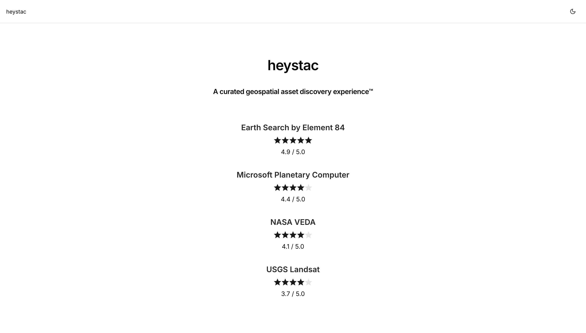

# heystac

[](https://github.com/gadomski/heystac/actions/workflows/ci.yaml)
[](https://github.com/gadomski/heystac/actions/workflows/pages.yaml)

> [!WARNING]
> This is a work in progress, _and_ @gadomski is 🗑️ at front-end dev, so set your expectations low.

A curated geospatial asset discovery experience™.



## Developing

Get [yarn](https://yarnpkg.com/).
Then:

```shell
yarn install
yarn dev
```

**heystac** is hosted with [Github Pages](https://github.com/gadomski/heystac/deployments/github-pages).

### Frontend

The frontend is built in [next.js](https://nextjs.org/), using [tailwind css](https://tailwindcss.com/) and [Development Seed's UI components](https://ui.ds.io).
The frontend code lives in [app](./app/).

### Backend

We have a command-line interface (CLI), also called **heystac**, for generating pre-rendered content.
The Python code for the CLI lives in [src](./src/).

## License

MIT
